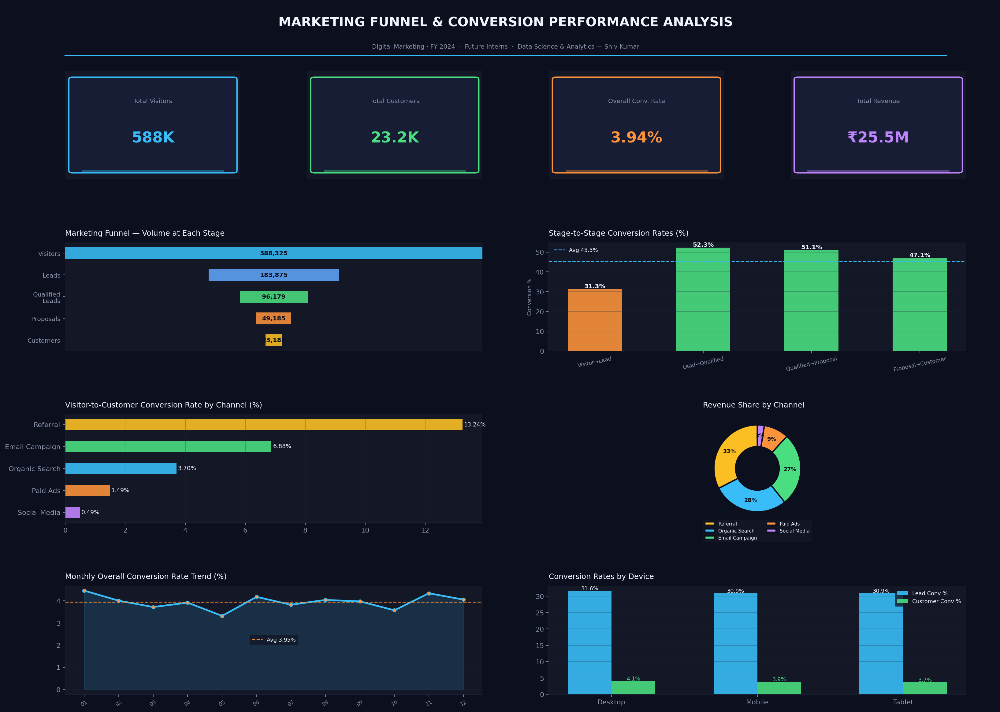

# FUTURE_DS_03 — Marketing Funnel & Conversion Performance Analysis

**Intern:** Shiv Kumar | **CIN:** FIT/MAY26/DS17882  
**Program:** Data Science & Analytics — Future Interns  
**Duration:** 13 May 2026 → 13 June 2026

---

## Task Overview

Analyze marketing funnel data to identify conversion drop-offs, channel performance, and opportunities to improve lead-to-customer conversion — delivered as a client-ready dashboard with actionable recommendations.

---

## Dashboard Preview



---

## Funnel Summary

| Stage | Volume | Conversion Rate |
|---|---|---|
| Visitors | 588,325 | — |
| Leads | 183,875 | 31.3% of Visitors |
| Qualified Leads | 96,179 | 52.3% of Leads |
| Proposals | 49,185 | 51.1% of Qualified |
| Customers | 23,188 | 47.1% of Proposals |
| **Overall Visitor → Customer** | — | **3.94%** |

Total Revenue generated: **₹25.5M**

---

## Key Findings

### 1. Biggest Drop-off: Visitor to Lead (31.3%)
Nearly 70% of all visitors never become leads. This is the widest funnel leak and the highest-impact area to fix. Improving landing page copy, CTAs, and lead capture forms could meaningfully shift this number.

### 2. Referral is the Highest-Converting Channel (13.24%)
Referral traffic converts at over 13%, compared to Social Media at just 0.49%. Referred users arrive with trust already established, making them far more likely to buy. This channel is underinvested relative to its returns.

### 3. Social Media Converts Poorly (0.49%)
Despite likely consuming a significant share of ad spend, Social Media delivers the weakest visitor-to-customer rate. The traffic volume is there but the intent is low. Either targeting needs refinement or social should be repositioned as a top-of-funnel awareness channel rather than a conversion channel.

### 4. Email Campaign is the Most Efficient Paid Channel (6.88%)
Email outperforms Paid Ads by more than 4x in conversion rate. Leads generated via email are warmer and more qualified before they even enter the funnel.

### 5. Mobile and Desktop Perform Similarly
Conversion rates are comparable across devices, which means the product experience is reasonably optimized for mobile — a positive signal.

---

## Recommendations

1. **Optimize top-of-funnel first** — A/B test landing pages and lead forms to improve the Visitor-to-Lead rate from 31% toward 40%+. This single improvement compounds across every downstream stage.
2. **Build a formal referral program** — Referral is already the best-converting channel. Introducing an incentive (discount, credit, reward) for existing customers to refer others can scale this channel significantly.
3. **Rethink Social Media spend** — Shift Social Media budget toward retargeting campaigns rather than cold audience acquisition, or reallocate it to Email and Referral which deliver proven returns.
4. **Invest more in Email nurturing** — Email converts at 6.88%. Expanding the email subscriber list and improving nurture sequences (follow-up cadence, personalization) can directly grow revenue.
5. **Protect the Proposal-to-Customer stage** — At 47.1%, this is the strongest stage in the funnel. Maintain quality here with timely follow-ups and clear value propositions in proposals.

---

## Tools Used

- **Python** — pandas, numpy, matplotlib
- **Dataset** — Simulated marketing funnel data (2,000 records, FY 2024)

## Files

| File | Description |
|---|---|
| `funnel_analysis.py` | Full Python analysis + dashboard code |
| `funnel_data.csv` | Generated funnel dataset |
| `funnel_dashboard.png` | Final dashboard image |

---

## How to Run

```bash
pip install pandas numpy matplotlib
python funnel_analysis.py
```

---

*Submitted as part of the Future Interns Data Science & Analytics Internship — Task 3*
